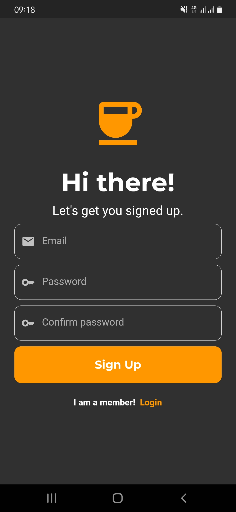
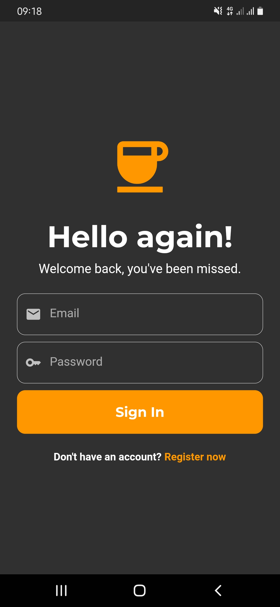
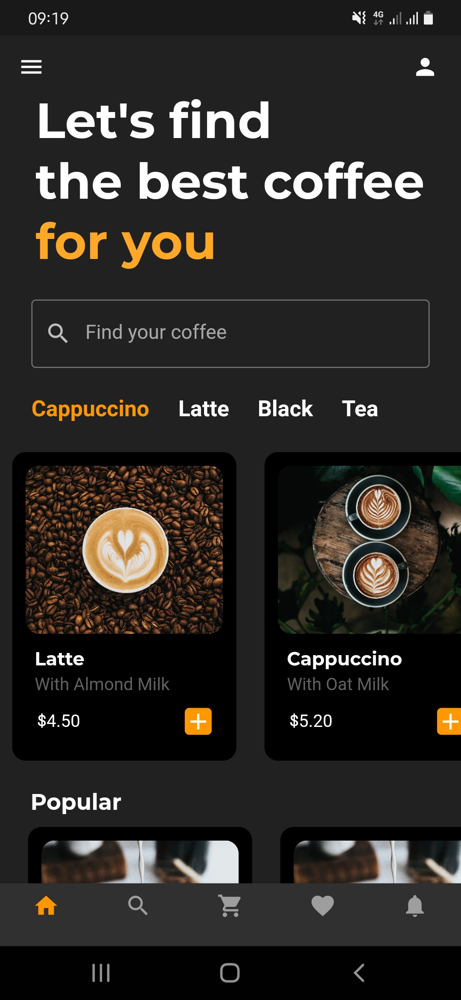
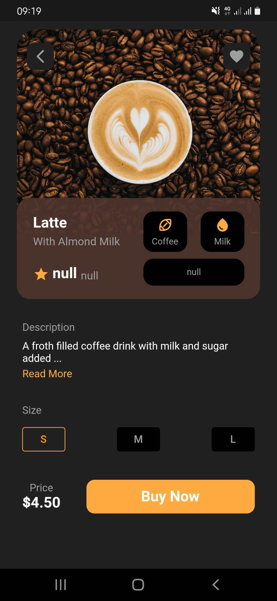

# coffee_app

A learning project to further my understanding of Mobile Development.

A small app used to place orders for coffee.

<table>
  <tr>
    <td>Sign Up Page</td>
     <td>Login Page</td>
     <td>Home Screen</td>
     <td>Detail Page</td>

  </tr>
  <tr>
    <td></td>
    <td></td>
    <td></td>
    <td></td>

  </tr>
 </table>

